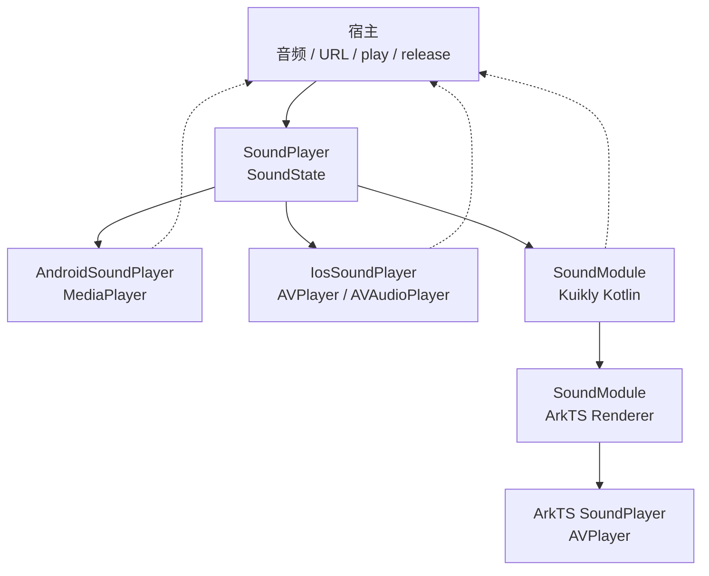
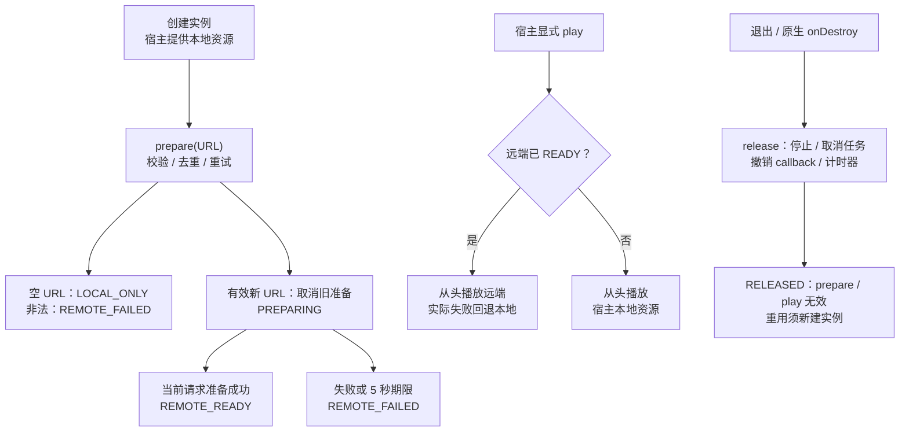
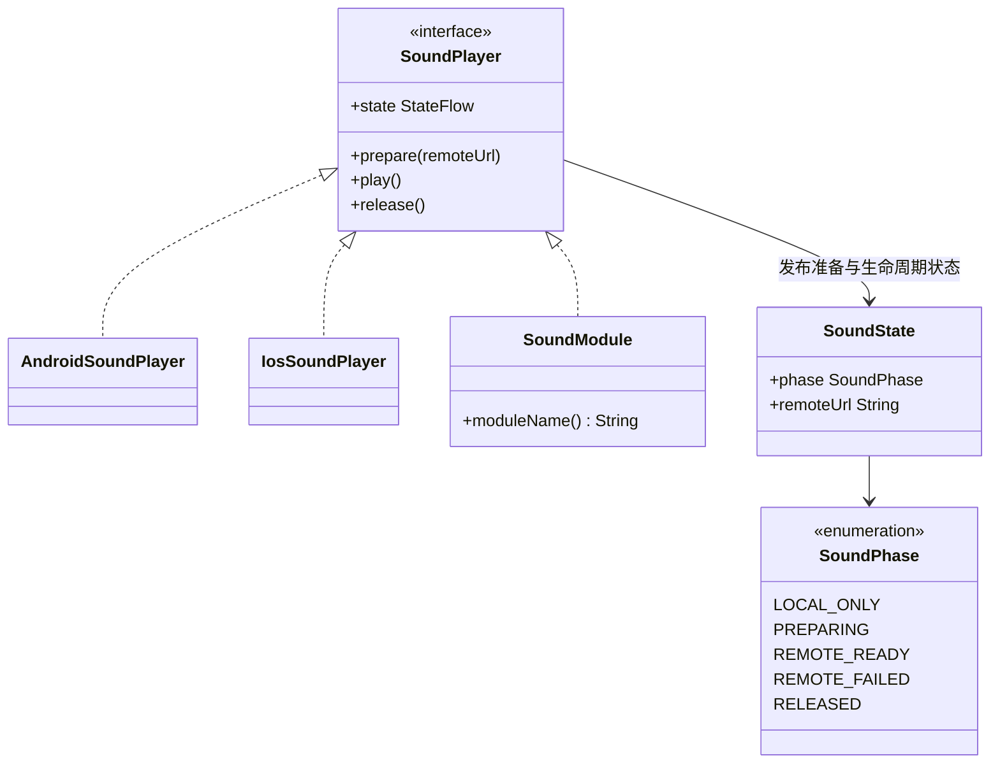

# GY CrossKit Sound

## 当前功能与平台边界

core 提供单短音效播放器、远端HTTPS预缓冲和本地回退；无CMP UI或Swift包装，sound-kuikly仅OHOS Module，A/i由宿主两套UI复用。

适用版本：Maven 0.1.5；HAR 0.1.1。本次修复与平台边界见[功能与平台差异](docs/功能与平台差异.md)，构建与渠道验收见[版本发布记录](https://github.com/gycrosskit/sound/releases/tag/0.1.5)；下方旧版本记录保留其历史范围。

当前测试覆盖、执行时点和未验收项集中见[验证范围](docs/功能与平台差异.md#验证范围)，复现命令见[开发与验证](docs/开发与验证.md)。

此版本包含已复核的跨端行为修复；[历史源码候选记录](docs/跨端行为候选.md)和下方旧版验收保持其原时点，当前范围见顶部功能与平台差异。

Android、iOS 和 HarmonyOS 的单个短音效播放器，支持 HTTPS 预加载、从头重播、宿主本地资源回退、准备状态和生命周期释放。音频文件、开关和业务事件由宿主提供。

Maven `0.1.3` 已发布并通过 JitPack 全制品校验与 Android/iOS/OHOS 干净消费，修复 iOS Main 线程入口；HAR 源码不变，保持 `0.1.0`。版本、校验值与验证边界见 [0.1.3 远程发布验收](docs/0.1.3远程发布验收.md)。

历史 Maven `0.1.2` 已发布 [prerelease](https://github.com/gycrosskit/sound/releases/tag/0.1.2)，修复 Android Main 线程入口；HAR 保持 `0.1.0`。Release 归档重下载 SHA 与 JitPack 全制品审计通过；精确合并提交、校验值、渠道限制及独立消费状态见 [0.1.2 远程发布验收](docs/0.1.2远程发布验收.md)。

## 架构与调用流程

宿主拥有一个短音效实例，提供本地音频、远端 URL 和播放触发；组件只管理准备、重播与释放。Kotlin 共享契约和 URL / 准备状态规则，真正播放落到各平台原生播放器。



`prepare()` 立即返回，准备结果异步更新；准备成功不自动播放。三端都使用原生网络预缓冲，不完整下载到库内 ByteArray/NSData，不能当作离线缓存。



Android/iOS `release()` 在 Main 上同步执行；后台调用排入 Main，观察 `state.phase == RELEASED` 确认关闭已执行，调用返回本身不保证资源已释放。Kuikly Kotlin `release()` 在所属页面线程同步关闭桥资格，不能由 Kotlin 状态推断原生资源已释放。OHOS 原生 `release()` 立即发布 RELEASED，并返回等待本地 AVPlayer 与 rawfile 描述符串行释放的 Promise；远端异步释放已经发起，不属于该 Promise 的完成保证。Android 按播放器对象、iOS/OHOS 按 generation 拒绝替换或释放前的迟回调；Kuikly Kotlin `release()` 移除常驻 callback 并异步通知原生。



源码入口：[共享契约与 URL 规则](sound-core/src/commonMain/kotlin/io/github/gycrosskit/sound/SoundPlayer.kt)、[Android 播放器](sound-core/src/androidMain/kotlin/io/github/gycrosskit/sound/AndroidSoundPlayer.kt)、[iOS 原生预缓冲与 generation](sound-core/src/iosMain/kotlin/io/github/gycrosskit/sound/IosSoundPlayer.kt)、[Kuikly Kotlin callback](sound-kuikly/src/commonMain/kotlin/io/github/gycrosskit/sound/kuikly/SoundModule.kt)、[OHOS Renderer](ohos/sound-native/src/main/ets/SoundModule.ets)、[OHOS 播放与串行释放](ohos/sound-native/src/main/ets/SoundPlayer.ets)。SoundState 不表示正在播放或本地资源可用；缺失或不可解码的本地资源会结束该次播放。

## 平台和 API

## 平台与模块

| 模块 | 平台与要求 |
| --- | --- |
| `sound-core` | Android API 24+ / iOS（建议宿主 iOS 14+）；`SoundPlayer` / `SoundState` 和原生实现 |
| `sound-kuikly` | OHOS Kotlin Module，Kuikly `2.28.0-2.0.21-ohos` |
| `@gycrosskit/sound` | HarmonyOS HAR，兼容 API 22；ArkTS 播放器与 Kuikly Renderer Module |

KMP 基线为 OpenHarmony Kotlin `2.2.21-1.0.0` / JDK 17 / Gradle 8.11.1 / AGP 8.10.1，coroutines `1.10.2-1.0.0`、Ktor `3.3.3-1.1.0-04`。iOS 编译/链接需 macOS / Xcode。Core 的 OHOS 变体仅提供公共契约，实际播放需原生 HAR。HAR 使用 API 26 SDK 构建，API 22 真机兼容尚未验收。

## 安装

在项目的 `settings.gradle.kts` 中配置：

```kotlin
dependencyResolutionManagement {
    repositories {
        google()
        mavenCentral()
        maven { url = uri("https://jitpack.io") }
        maven { url = uri("https://maven.eazytec-cloud.com/nexus/repository/maven-public/") }
        maven { url = uri("https://mirrors.tencent.com/nexus/repository/maven-tencent/") }
        exclusiveContent {
            forRepository {
                maven { url = uri("https://mirrors.tencent.com/nexus/repository/maven-tencent/") }
            }
            filter { includeGroup("com.tencent.kuikly-open") }
        }
    }
}
```

共享模块 `build.gradle.kts`：

```kotlin
kotlin {
    sourceSets {
        commonMain.dependencies {
            implementation("com.github.gycrosskit.sound:sound-core:0.1.5")
        }
    }
}
```

HarmonyOS 原生宿主：

```sh
ohpm install @gycrosskit/sound@0.1.1
```

插件仓库、Kuikly 依赖及注册见[接入指南](docs/接入指南.md)。Maven `0.1.3` 与 HAR `0.1.0` 分别版本化。

## 快速使用

Android 在 `androidMain` 创建播放器，音频文件放入宿主 `res/raw`：

```kotlin
import io.github.gycrosskit.sound.AndroidSoundPlayer

val sound = AndroidSoundPlayer(context, R.raw.host_sound)
sound.prepare("https://cdn.example.com/sound.wav")
sound.play()
// 页面或拥有播放器的会话退出时：
sound.release()
```

iOS 使用 `IosSoundPlayer("host_sound", "wav")`，文件放入宿主 Bundle；ArkTS 使用 `SoundPlayer(resourceManager, "host_sound.wav", onState)`，文件放入宿主 `resources/rawfile`。详细示例见接入指南。

`prepare()` 异步准备远端且不会自动播放。`play()` 从头重播，远端未就绪或播放失败时使用本地资源；本地不可用则静默结束。实例只播放一个短音效，不提供混音或队列。

`state` 只表示 `LOCAL_ONLY / PREPARING / REMOTE_READY / REMOTE_FAILED / RELEASED`，不表示正在播放。Android/iOS 的 prepare/play/release 可由任意线程调用：Main 立即执行，后台排入 Main；播放器创建、回调、超时、替换与释放共用 Main。Kuikly 使用所属页面线程。后台 `release()` 返回不代表已完成，以 `state.phase == RELEASED` 确认；关闭后排队请求不能复活实例。`release()` 永久关闭且可重复调用，再次使用需新实例；ArkTS 的释放包含异步资源清理。

三端使用原生网络预缓冲且无库内文件字节上限，不保证离线播放。宿主限制文件大小、时长及 HTTPS 重定向链，iOS 音频会话由宿主管理。

## 文档与支持

- [接入指南](docs/接入指南.md)：资源、Swift 导出、Kuikly、状态及超时边界。
- [开发与验证](docs/开发与验证.md)、[历史验证记录](VERIFICATION.md)：构建和独立消费范围。
- [GitHub Releases](https://github.com/gycrosskit/sound/releases)：Maven / HAR 版本和归档。
- [GitHub Issues](https://github.com/gycrosskit/sound/issues)：提供平台、版本、音频格式和最小复现。

现有记录覆盖远程 Maven / OHPM 产物编译、iOS Simulator 链接、Swift typecheck 和行为替身测试；真机播放、音频会话及 API 22 设备兼容仍待宿主验收。

自有源码使用 [Apache-2.0](LICENSE)，第三方依赖遵循各自许可。

本轮全生产文件覆盖与未测项见[完整源码审查](docs/完整源码审查.md)。

## 自动回归

[Component regression](.github/workflows/regression.yml) 在 PR 和 `main` 更新时运行现有 Python/Node 契约测试、Android 单元测试及编译，以及 macOS 上的 iOS/OHOS KLIB 编译；已有 iOS、JVM、Kuikly 独立测试也按该 workflow 执行。Release 发布或手动指定不可变版本后，校验 Release Maven 归档的 SHA-256、POM、metadata 与文件引用，并从 JitPack 独立编译 Android 消费者、链接 iOS 消费者、编译 OHOS Kuikly 消费者。此流程不发布二进制。

OHOS KLIB 编译不代表 HAR 构建、ohpm 上架或真机验收。当前没有已确认可用的 DevEco/Hvigor runner，这些检查尚未自动化，不能作为 CI 通过范围。

PR 的发布回归固定验证已发布 `0.1.3` 基线，五个 job 都通过后才合并；Release 事件使用其精确标签。基线证明远程产物可消费，不代表 PR 新源码已发布。
